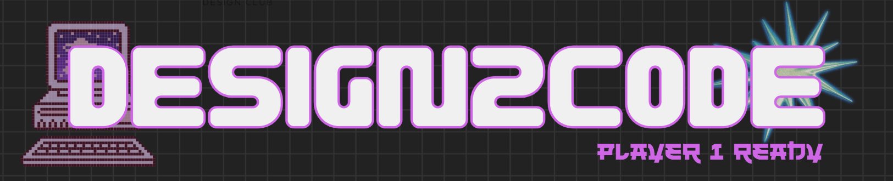
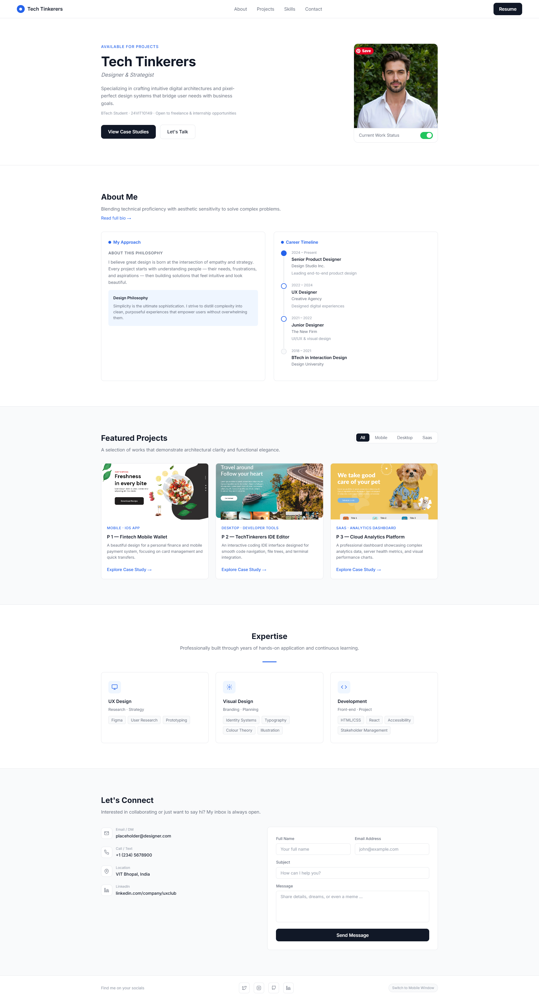

<div align="center">
  
</div>

<br/>

<div align="center">
<h2>🚀 From Wireframe to Reality - in 48 Hours.</h2>
<p>Team Tech Tinkerers' submission for <strong>Design2Code 2.0</strong>, hosted by <strong>UX Club, VIT Bhopal</strong>.<br/>
We took a wireframe, brought it to life, and shipped it - no frameworks, no shortcuts.</p>
</div>

---

> ## Preview

<div align="center">



</div>


---

## 🔗 Live Demo

<div align="center">

**[→ techtinkerersdesign2code20.vercel.app](https://techtinkerersdesign2code20.vercel.app/)**

</div>

---

## 🎯 About the Event

**Design2Code 2.0** is a 48-hour frontend hackathon organized by the **UX Club, VIT Bhopal** — where creativity meets code. Teams receive a wireframe and race to build it into a fully functional, responsive web experience.


### Event Schedule

```
DAY 1 — 21 JUNE · WIREFRAME CHALLENGE
  ▸ Problem Statement Release
  ▸ User Flow Planning
  ▸ Wireframing & Ideation
  ▸ UX Evaluation

DAY 2 — 22-23 JUNE · FRONTEND DEVELOPMENT
  ▸ Convert Designs into Code
  ▸ Responsive Development
  ▸ Final Submission
  ▸ Winners Announcement
```

### ✨ Event Highlights

- **Real-World Challenge**
- **UI/UX + Development**
- **Wireframe → Working Product** - end-to-end in 48 hours
- **Certificates for All** - every participant gets recognized
- **Showcase Your Skills** - in front of judges and peers

---

## 🛠️ Tech Stack

```
╔══════════════════════════════════════════╗
║  HTML5       →  Structure & Semantics    ║
║  CSS3        →  Styling & Animations     ║
║  JavaScript  →  Logic & Interactivity    ║
║  Vercel      →  Deployment & Hosting     ║
╚══════════════════════════════════════════╝
```

---

## 📂 Project Structure

```
tech-tinkerers_design2code2.0/
│
├── assets/        ←  Images & static files
├── index.html     ←  Entry point
├── style.css      ←  All the visual magic
└── main.js        ←  Interactions & logic
```

---

## ⚙️ Run Locally

Zero dependencies. Zero build steps. Just clone and open.

```bash
# Clone the repo
git clone https://github.com/RishiRaj1495/tech-tinkerers_design2code2.0.git

# Jump in
cd tech-tinkerers_design2code2.0

# Launch it
open index.html
```

> 🔥 Use the **Live Server** extension in VS Code for instant hot-reload while editing.

<div align="center">
<table>
  <tr>
    <td align="center">
      <a href="https://github.com/RishiRaj1495">
        <br/>
        <sub><b>Rishi Raj</b></sub>
      </a>
    </td>
    <td align="center">
      <a href="https://github.com/swastiksinha1">
        <br/>
        <sub><b>Swastik Sinha</b></sub>
      </a>
    </td>
    <td align="center">
      <a href="https://github.com/Abhilash-2210">
        <br/>
        <sub><b>Abhilash Singh</b></sub>
      </a>
    </td>
    <td align="center">
      <a href="https://github.com/ari9516">
        <br/>
        <sub><b>ari9516</b></sub>
      </a>
    </td>
  </tr>
</table>
</div>

## 📄 License

Open source under the [MIT License](LICENSE).

---

<div align="center">
  <sub>
    Built under pressure. Shipped with pride. 💜<br/>
    <strong>Team Tech Tinkerers</strong> &nbsp;·&nbsp; Design2Code 2.0 &nbsp;·&nbsp; UX Club, VIT Bhopal<br/>
    <em>THINK. DESIGN. DEVELOP.</em>
  </sub>
</div>
